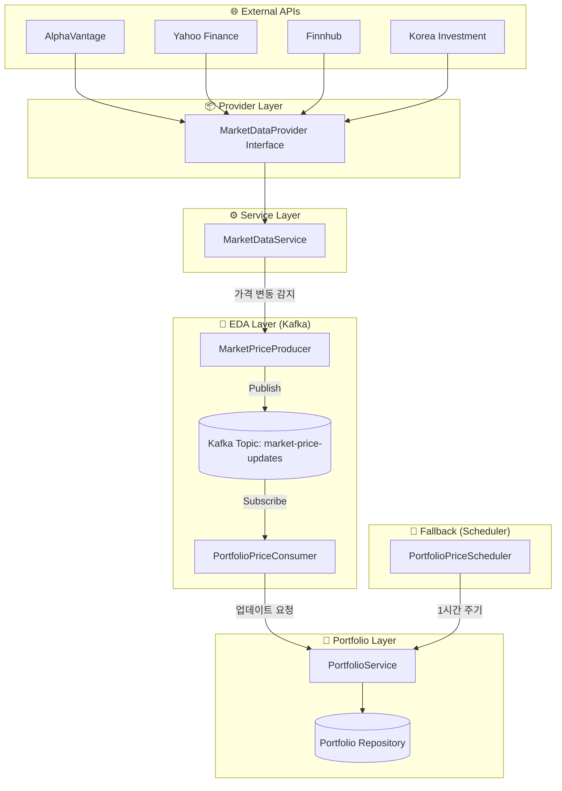
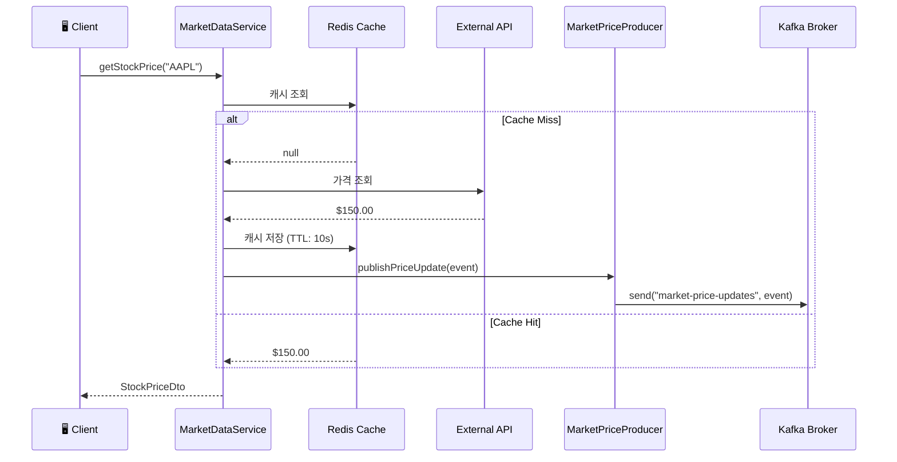
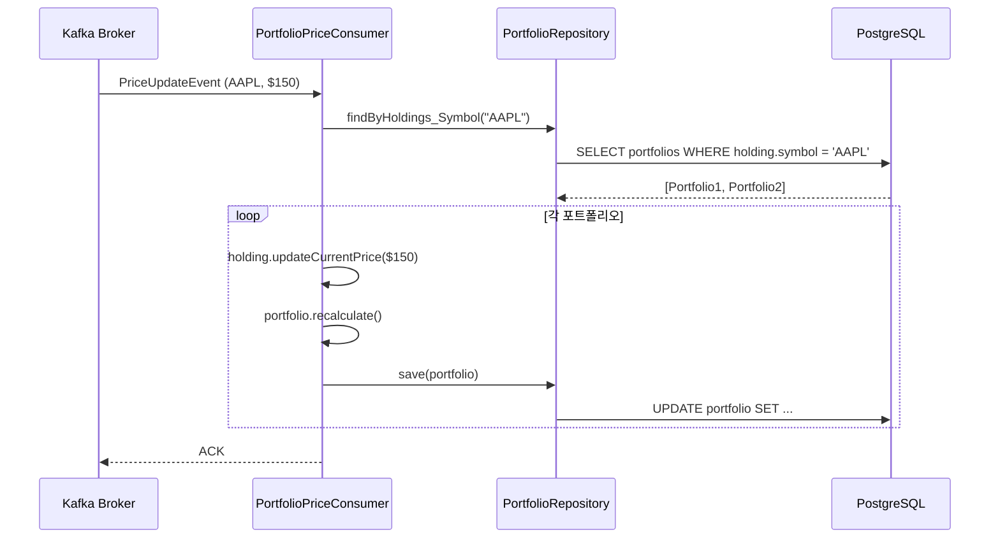
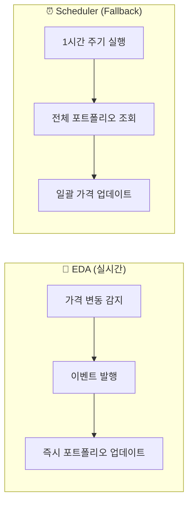

# 🔄 Event-Driven Architecture (EDA)

> **Sentinel Backend**의 실시간 가격 업데이트 파이프라인

---

## 📐 전체 아키텍처



---

## 📍 EDA 적용 위치

### 파일 구조

```
src/main/java/com/pjsent/sentinel/
├── common/
│   └── event/
│       └── 📄 PriceUpdateEvent.java       ← 이벤트 메시지 정의
│
├── market/
│   ├── producer/
│   │   └── 📄 MarketPriceProducer.java    ← Kafka 이벤트 발행
│   └── service/
│       └── 📄 MarketDataService.java      ← 가격 조회 (트리거 지점)
│
├── portfolio/
│   ├── consumer/
│   │   └── 📄 PortfolioPriceConsumer.java ← Kafka 이벤트 수신/처리
│   └── scheduler/
│       └── 📄 PortfolioPriceScheduler.java ← Fallback 스케줄러
│
└── docker-compose.yml                      ← Kafka/Zookeeper 설정
```

---

## 🔀 상세 데이터 플로우

### 1️⃣ 이벤트 발행 (Producer)



**위치**: `market/producer/MarketPriceProducer.java`

```java
@Component
public class MarketPriceProducer {
    private final KafkaTemplate<String, Object> kafkaTemplate;
    private static final String TOPIC = "market-price-updates";

    public void publishPriceUpdate(PriceUpdateEvent event) {
        log.debug("Publishing price update: {}", event);
        kafkaTemplate.send(TOPIC, event.symbol(), event);
    }
}
```

---

### 2️⃣ 이벤트 수신 (Consumer)



**위치**: `portfolio/consumer/PortfolioPriceConsumer.java`

```java
@Component
public class PortfolioPriceConsumer {
    
    @KafkaListener(topics = "market-price-updates", groupId = "sentinel-group")
    @Transactional
    public void handlePriceUpdate(PriceUpdateEvent event) {
        // 해당 종목을 보유한 모든 포트폴리오 조회
        List<Portfolio> portfolios = portfolioRepository.findByHoldings_Symbol(event.symbol());
        
        for (Portfolio portfolio : portfolios) {
            for (PortfolioHolding holding : portfolio.getHoldings()) {
                if (holding.getSymbol().equals(event.symbol())) {
                    holding.updateCurrentPrice(event.price());
                }
            }
            portfolio.recalculate();
            portfolioRepository.save(portfolio);
        }
    }
}
```

---

### 3️⃣ 이벤트 메시지 (Event)

**위치**: `common/event/PriceUpdateEvent.java`

```java
public record PriceUpdateEvent(
    String symbol,           // 종목 심볼 (예: AAPL)
    BigDecimal price,        // 현재 가격
    AssetType assetType,     // STOCK, CRYPTO, ETF 등
    LocalDateTime timestamp  // 가격 시점
) {}
```

---

## 🔄 EDA vs Scheduler 비교



| 구분 | EDA (Kafka) | Scheduler (Fallback) |
|------|-------------|----------------------|
| **트리거** | 가격 변동 시 | 1시간 주기 |
| **지연 시간** | 수 초 이내 | 최대 1시간 |
| **용도** | 실시간 업데이트 | 데이터 정합성 보장 |
| **위치** | `PortfolioPriceConsumer` | `PortfolioPriceScheduler` |

---

## 🧪 테스트

### EmbeddedKafka 통합 테스트

**위치**: `test/.../integration/EDAIntegrationTest.java`

```java
@SpringBootTest
@EmbeddedKafka(partitions = 1, topics = {"market-price-updates"})
class EDAIntegrationTest {
    
    @Test
    void endToEndPriceUpdate() {
        // given
        PriceUpdateEvent event = new PriceUpdateEvent("AAPL", BigDecimal.valueOf(155.0), ...);
        
        // when - 이벤트 발행
        marketPriceProducer.publishPriceUpdate(event);
        
        // then - 비동기 처리 검증 (최대 10초 대기)
        await().atMost(10, TimeUnit.SECONDS).untilAsserted(() -> {
            verify(holding).updateCurrentPrice(BigDecimal.valueOf(155.0));
            verify(portfolio).recalculate();
        });
    }
}
```

**실행**:
```bash
./gradlew test --tests "EDAIntegrationTest"
```

---

## ⚙️ 설정

### Docker Compose

```yaml
# Zookeeper
zookeeper:
  image: confluentinc/cp-zookeeper:7.5.0
  ports: ["2181:2181"]

# Kafka
kafka:
  image: confluentinc/cp-kafka:7.5.0
  ports: ["9092:9092"]
  environment:
    KAFKA_ADVERTISED_LISTENERS: PLAINTEXT://kafka:29092,PLAINTEXT_HOST://localhost:9092
```

### Gradle

```gradle
implementation 'org.springframework.kafka:spring-kafka'
testImplementation 'org.springframework.kafka:spring-kafka-test'
```

---

## 📝 관련 문서

- [PROJECT_STRUCTURE.md](./PROJECT_STRUCTURE.md)
- [API_MAP.md](./API_MAP.md)
