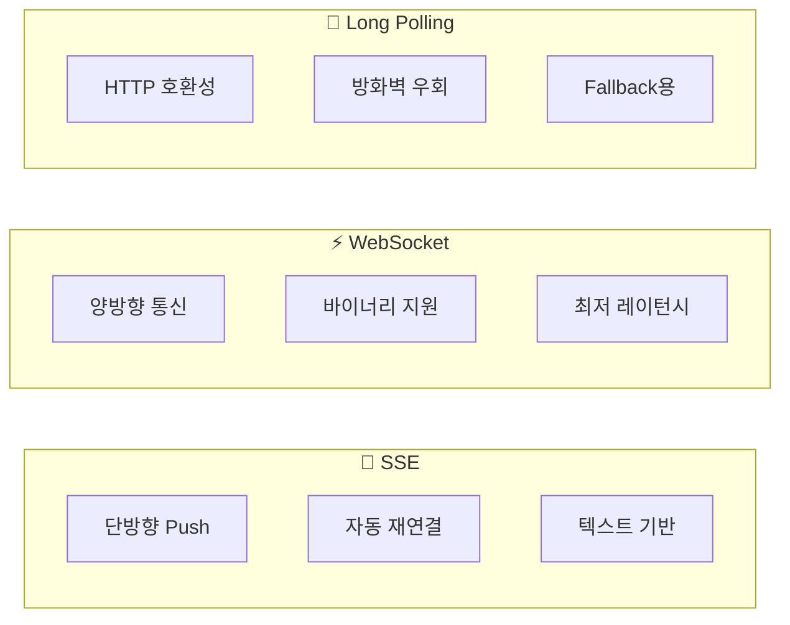
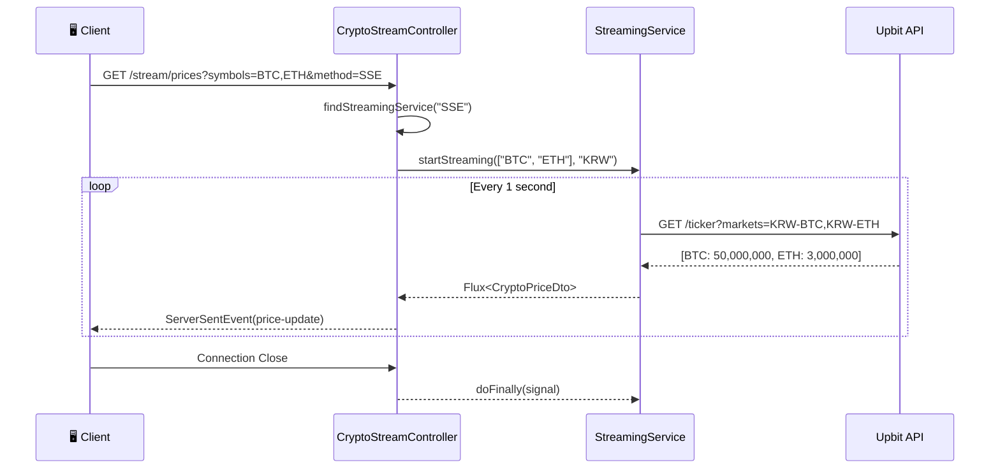

# 📡 Real-time Streaming Architecture

> **Sentinel Backend**의 실시간 암호화폐 가격 스트리밍

---

## 📐 전체 아키텍처

```mermaid
flowchart TB
    subgraph Client["🖥️ Client"]
        Web[Web Browser]
        App[Mobile App]
    end

    subgraph Controller["🎯 Controller"]
        CSC[CryptoStreamController]
    end

    subgraph Streaming["📡 Streaming Layer (Adapter Pattern)"]
        SI[StreamingService Interface]
        SSE[SSEStreamingService]
        WS[WebSocketStreamingService]
        LP[LongPollingStreamingService]
        
        SI --> SSE
        SI --> WS
        SI --> LP
    end

    subgraph External["🌐 External API"]
        Upbit[Upbit API]
    end

    Web -->|GET /stream/prices?method=SSE| CSC
    App -->|GET /stream/prices?method=WebSocket| CSC
    CSC -->|findStreamingService()| SI
    SSE -->|Flux poll| Upbit
    WS -->|Flux poll| Upbit
    LP -->|Flux poll| Upbit
```

---

## 📍 파일 구조

```
src/main/java/com/pjsent/sentinel/crypto/
├── controller/
│   └── 📄 CryptoStreamController.java    ← REST API 엔드포인트
│
├── streaming/
│   ├── 📄 StreamingService.java          ← 인터페이스 (Adapter Pattern)
│   ├── 📄 SSEStreamingService.java       ← SSE 구현 (권장 ✅)
│   ├── 📄 WebSocketStreamingService.java ← WebSocket 구현 (고성능 ⚡)
│   └── 📄 LongPollingStreamingService.java ← Long Polling (Fallback 🔄)
│
└── dto/
    └── 📄 CryptoPriceDto.java            ← 가격 데이터 DTO
```

---

## 🔀 스트리밍 방식 비교



| 방식 | 레이턴시 | 장점 | 단점 | 권장 사용처 |
|------|----------|------|------|-------------|
| **SSE** | 50ms | 자동 재연결, 간단한 구현 | 단방향만 지원 | 웹 대시보드 ✅ |
| **WebSocket** | 10ms | 양방향, 최고 성능 | 연결 관리 복잡 | 트레이딩 앱 ⚡ |
| **LongPolling** | 1000ms | 호환성 최고 | 높은 오버헤드 | 레거시 시스템 🔄 |

---

## 🔄 데이터 플로우



---

## 💻 API 엔드포인트

### 1️⃣ 실시간 가격 스트리밍

```bash
# SSE (권장)
curl -N "http://localhost:8080/api/v1/crypto/stream/prices?symbols=BTC,ETH&method=SSE"

# WebSocket
curl -N "http://localhost:8080/api/v1/crypto/stream/prices?symbols=BTC,ETH&method=WebSocket"

# Long Polling
curl -N "http://localhost:8080/api/v1/crypto/stream/prices?symbols=BTC,ETH&method=LongPolling"
```

**Response (SSE)**:
```
event: price-update
data: {"symbol":"BTC","price":50000000,"change":1.5,"timestamp":"2024-12-08T02:00:00"}

event: price-update
data: {"symbol":"ETH","price":3000000,"change":0.8,"timestamp":"2024-12-08T02:00:01"}
```

---

### 2️⃣ 사용 가능한 스트리밍 방식 조회

```bash
curl "http://localhost:8080/api/v1/crypto/stream/methods"
```

**Response**:
```json
{
  "methods": [
    {
      "name": "SSE",
      "available": true,
      "useCase": "웹 대시보드, 가격 모니터링",
      "updateInterval": "1000ms",
      "latency": "50ms"
    },
    {
      "name": "WebSocket",
      "available": true,
      "useCase": "실시간 트레이딩, 고빈도 업데이트",
      "updateInterval": "500ms",
      "latency": "10ms"
    }
  ],
  "recommended": "SSE",
  "count": 3
}
```

---

### 3️⃣ 서비스 상태 확인

```bash
curl "http://localhost:8080/api/v1/crypto/stream/status"
```

**Response**:
```json
{
  "totalServices": 3,
  "availableServices": 3,
  "services": [
    {"name": "SSE", "status": "UP"},
    {"name": "WebSocket", "status": "UP"},
    {"name": "LongPolling", "status": "UP"}
  ]
}
```

---

## 🏗️ 핵심 코드

### StreamingService 인터페이스 (Adapter Pattern)

```java
public interface StreamingService {
    // 실시간 가격 스트리밍 시작
    Flux<CryptoPriceDto> startStreaming(List<String> symbols, String baseCurrency);
    
    // 스트리밍 방식 이름 ("SSE", "WebSocket", "LongPolling")
    String getStreamingMethod();
    
    // 서비스 사용 가능 여부
    boolean isAvailable();
}
```

### SSE 구현체

```java
@Service
public class SSEStreamingService implements StreamingService {
    
    @Override
    public Flux<CryptoPriceDto> startStreaming(List<String> symbols, String baseCurrency) {
        return Flux.interval(Duration.ofSeconds(1))  // 1초마다 호출
                .flatMap(tick -> cryptoDataService.getPrices(symbols, baseCurrency))
                .doOnSubscribe(sub -> log.info("SSE 스트리밍 시작"))
                .doFinally(signal -> log.info("SSE 스트리밍 종료"));
    }
    
    @Override
    public String getStreamingMethod() {
        return "SSE";
    }
}
```

---

## 📝 관련 문서

- [EDA_ARCHITECTURE.md](./EDA_ARCHITECTURE.md)
- [PROJECT_STRUCTURE.md](./PROJECT_STRUCTURE.md)
- [API_MAP.md](./API_MAP.md)
